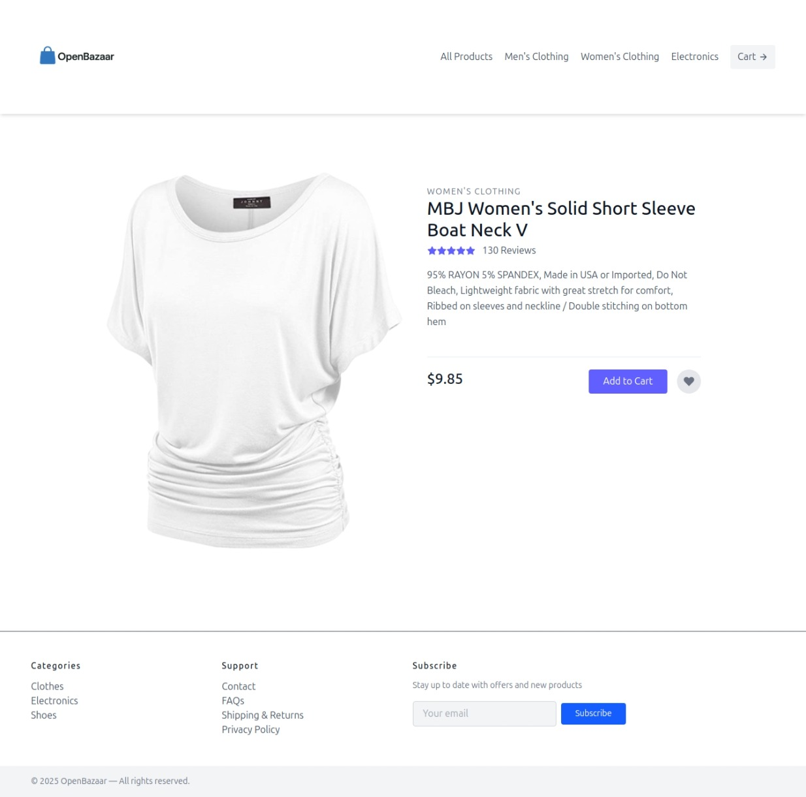
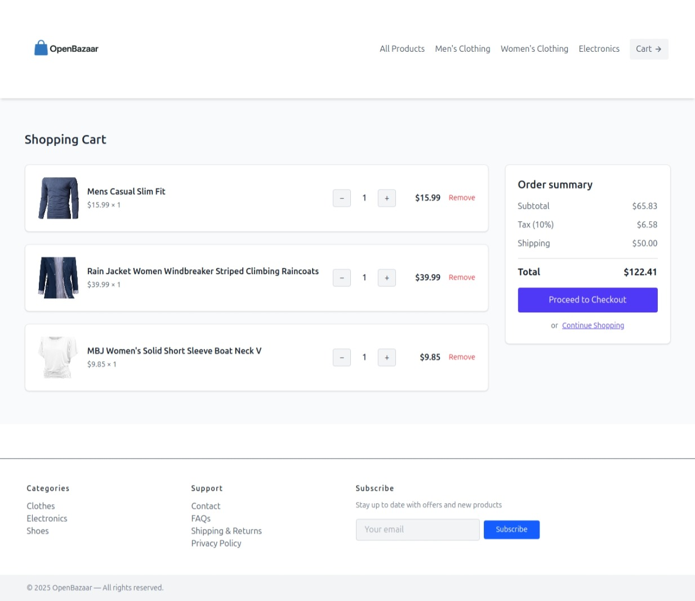

 FakeStore React Project Documentation

FakeStore React Project
=======================

Overview
--------

This is a frontend project built using the FakeStore API. It demonstrates several core React concepts including state management, routing, and reusable components. Users can browse products, view product details, and manage a shopping cart.

Key Features
------------

*   Data fetched from **FakeStore API**
*   Used **Reducers** for cart state management
*   Used **Context API** for global state
*   Created **Custom Hooks** for data fetching
*   Styled using **Tailwind CSS**
*   **React Router DOM** for client-side routing
*   Cart operations such as add, remove, and clear items

Pages
-----

### 1\. Home Page

The home page displays all products retrieved from the FakeStore API. Products are shown in a responsive grid layout.

### 2\. Single Product Page

When a user clicks on a product, they are taken to the Single Product page. This page shows detailed information about the selected product.

### 3\. Cart Page

The cart page displays all the items the user has added to their cart. Users can increase/decrease quantity or remove items completely. Cart operations are managed using reducers.

Technologies Used
-----------------

*   React
*   React Router DOM
*   Tailwind CSS
*   Context API
*   useReducer Hook
*   Custom Hooks
*   FakeStore API

Project Structure
-----------------

*   `/components` - Reusable UI components
*   `/pages` - Pages like Home, Product, Cart
*   `/context` - Global state using Context API
*   `/hooks` - Custom hooks for data fetching
*   `/reducers` - Reducer logic for cart
*   `/layouts` - Layout components with navbar/footer

How to Run
----------

1.  Clone the repository
2.  Run `npm install`
3.  Run `npm start`
4.  Open `http://localhost:3000` in your browser

Credits
-------

API Source: [FakeStoreAPI.com](https://fakestoreapi.com)
